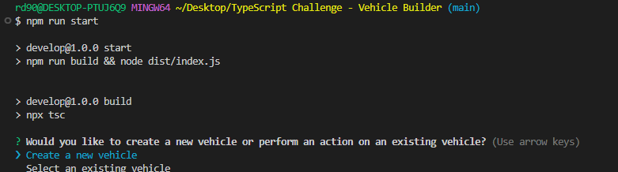
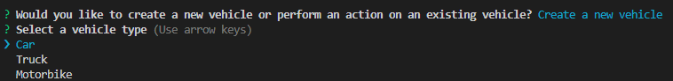
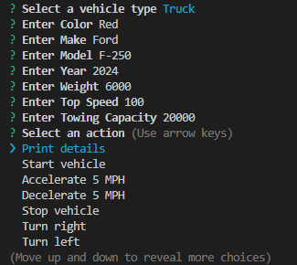
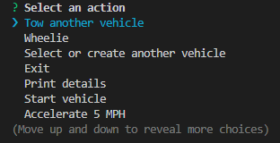
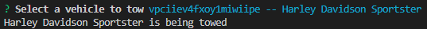
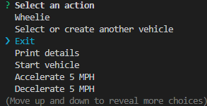

# Vehicle Builder

## Introduction

This project demonstrates the principles of Object-Oriented Programming (OOP). Watch the video below to learn more about the project:

https://drive.google.com/file/d/1V79NqxrkJbFsim-jws5jWRSQWB-9nhYc/view?usp=drive_link

## Description

This project prompts the user to create new vehicles or select existing ones, demonstrating the principles of Object-Oriented Programming (OOP). By creating a Vehicle class as the base class and extending it to create specific vehicle types (Car, Truck, and Motorbike), the project showcases the concept of inheritance. Implementing "Driveable" functions (start, accelerate, decelerate, stop, turn, and reverse) in the Vehicle class demonstrates polymorphism. The Truck class further demonstrates composition by adding its own methods specific to trucks, such as "towingCapacity" and "tow". This project has enhanced understanding of how to model real-world objects and systems using OOP concepts.

## Table of Contents

- [Installation](#installation)
- [Usage](#usage)
- [License](#license)
- [Contributing](#contributing)
- [Tests](#tests)
- [Questions](#questions)

## Installation

1. Clone the repository: start by cloning the repository to your local machine using Git. Open your terminal or command prompt and run `git clone <repository_url>`. Replace the `<repository_url>` with the URL of the repository you want to clone.
2. Navigate to the project directory: change your current directory to the project directory by running `cd <project_directory>`. Replace `<project_directory>` with the name of the directory where the project is located.
3. Install dependencies: run `npm i` to install the dependencies listed in the `package.json` file.
4. Run the project: run `npm run start` to compile the TypeScript files into the JavaScript files and to run the `node dist/index.js` file.

## Usage

1. Select “Create a new vehicle” or “Select an existing vehicle”.

   

2. If you select “Create a new vehicle”, then select “Car”, “Truck”, or “Motorbike”.

   

3. Enter the details for the vehicle until prompted with “Select an action”.

   

4. Select an action for the vehicle. For example, if you selected “Truck” then you may select “Tow another vehicle”.

   

5. If you selected a Truck followed by “Tow another vehicle” then select the vehicle you would like to tow, for example “Harley Davidson Sportster”. The output will display in the command interface.

   

6. You may then select another action. Select “Exit” to exit the application.

   

## License

This project is licensed under the MIT license.

## Contributing

- Author:
  [Rory Dowse](https://github.com/RoryDowse).

- Third-party assets:  
  [Classes](https://www.typescriptlang.org/docs/handbook/2/classes.html)  
  [Object Types](https://www.typescriptlang.org/docs/handbook/2/objects.html)  
  [Everyday Types](https://www.typescriptlang.org/docs/handbook/2/everyday-types.html)  
  [More on Functions](https://www.typescriptlang.org/docs/handbook/2/functions.html)

## Tests

1. Create a new vehicle and perform an action:   
   Run the application and select "Create a new vehicle".
   Choose a vehicle type (e.g., "Car", "Truck", or "Motorbike").
   Enter the required details for the vehicle.
   Select an action for the vehicle (e.g., "Tow another vehicle" for a Truck).
   Verify that the application displays the correct output for the selected action.

2. Select an existing vehicle and perform an action:   
   Run the application and select "Select an existing vehicle".
   Choose an existing vehicle from the list.
   Select an action for the vehicle (e.g., "Tow another vehicle" for a Truck).
   Verify that the application displays the correct output for the selected action.

3. Exit the application:   
   Run the application and select "Exit".
   Verify that the application closes correctly.

4. Invalid input:   
   Run the application and enter invalid input (e.g., a non-existent vehicle type).
   Verify that the application displays an error message and prompts the user to try again.

5. Edge cases:   
   Run the application and test edge cases, such as:
   Creating a vehicle with minimum or maximum values for attributes (e.g., minimum or maximum speed for a Car).
   Selecting an action that is not available for the chosen vehicle type.

## Questions

Please visit my GitHub profile: https://github.com/RoryDowse. 
For additional questions, please contact me at: rorydowse@hotmail.com.
